# Line美食地圖機器人
## 動機：簡化搜尋與選擇的過程，按幾個按鍵就能達成快速決定要吃甚麼的目標
## 功能：設定地理位置、設定篩選條件、隨機選擇餐廳、使用關鍵字等條件搜尋餐廳、列出附近餐廳列表、於Google Maps中顯示餐廳地理位置
## 特色：使用Google的Maps Platform API精準找到餐廳

### FSM

    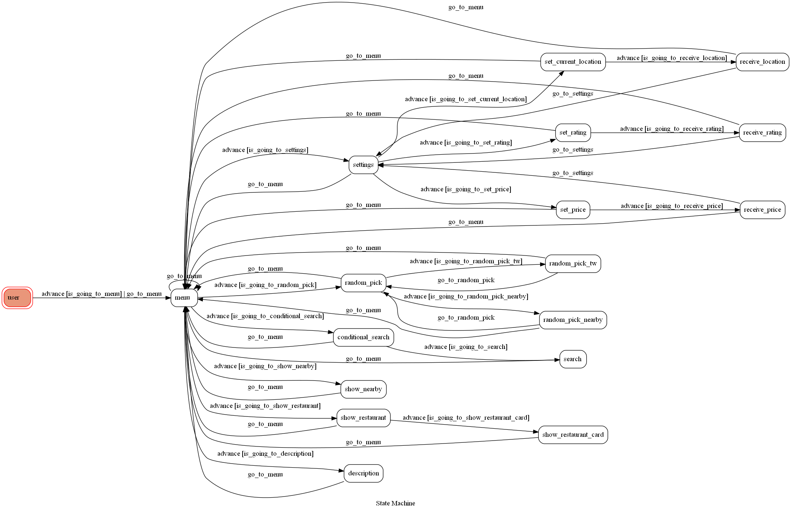

## Features

### 主選單

    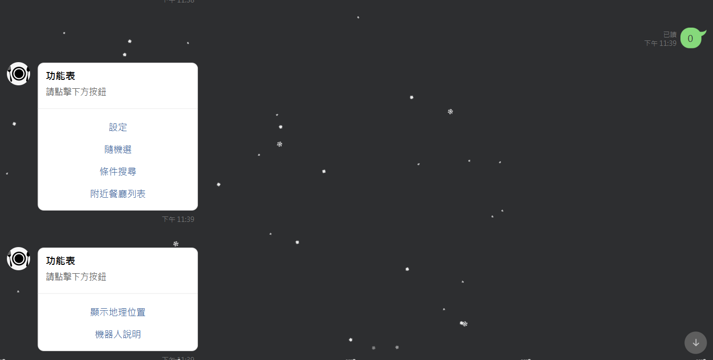

### Line Bot用法
機器人使用教學

    

### 設定

    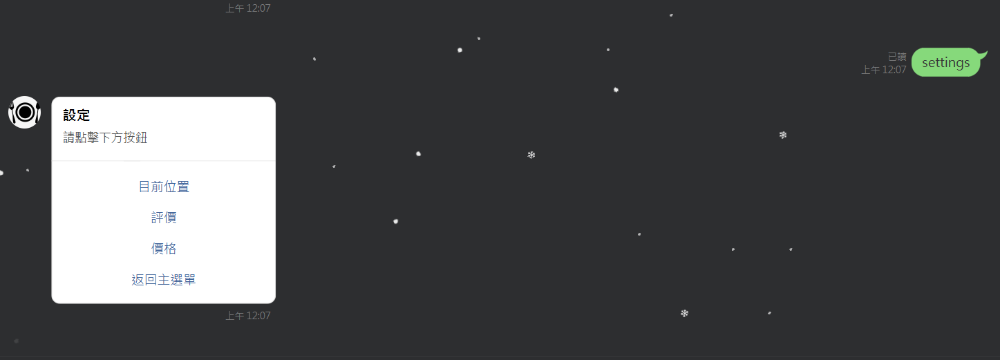

1.設定所在的位置

    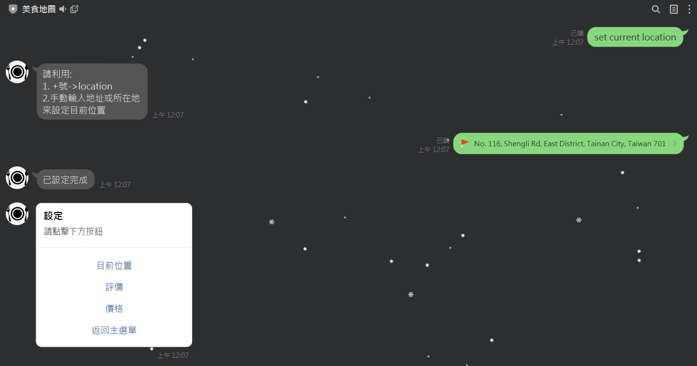

2.設定餐廳評價條件

    

3.設定餐廳價格條件

    

### 隨機挑選

    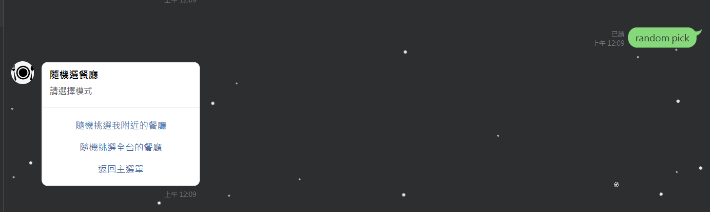

1.隨機挑選附近的餐廳

    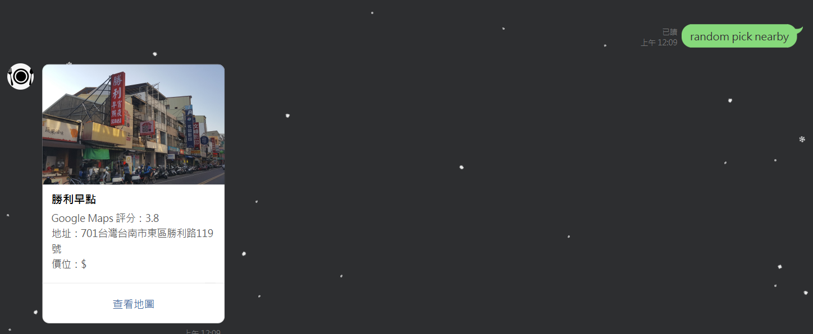

2.隨機挑選台灣國內的餐廳

    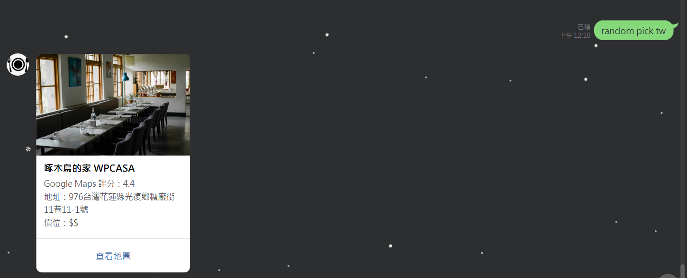

3.「查看地圖」截圖

    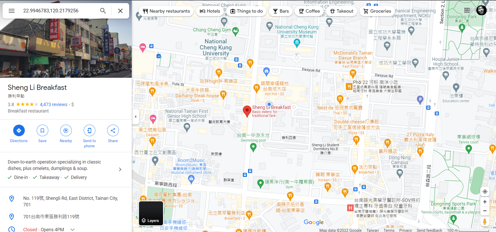

### 條件搜尋(會參考篩選條件：評價、價位等)

    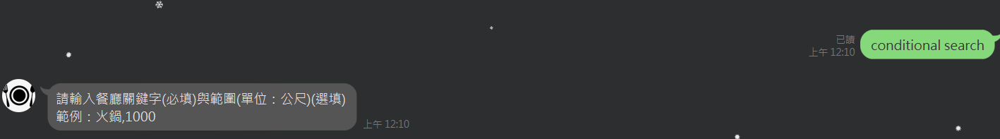

結果：

    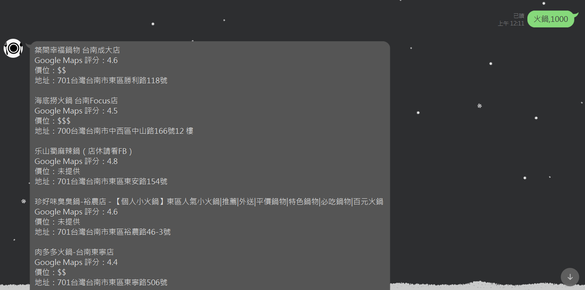

### 附近餐廳列表

    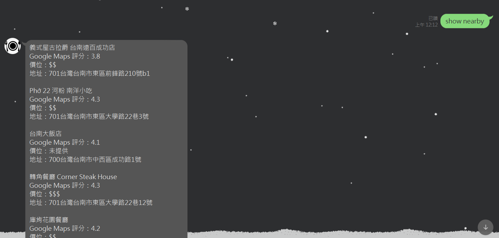

### 顯示地理位置

    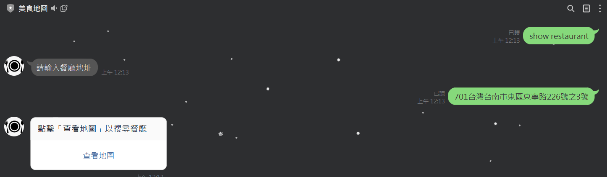

